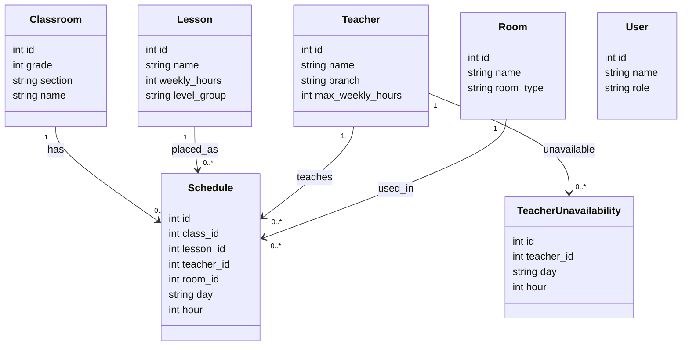

# Database UML

Bu diyagram okul ders programi sisteminin SQLite tablo yapisini gosterir.

## Kurallar

- `classes.name` benzersizdir. Ornek: `5-A`.
- `lessons.name` benzersizdir. Ornek: `Matematik`.
- `schedules.class_id + day + hour` benzersizdir; bir sinif ayni anda iki ders alamaz.
- `schedules.teacher_id + day + hour` benzersizdir; bir ogretmen ayni anda iki sinifa giremez.
- `rooms` derslik/laboratuvar/spor salonu gibi fiziksel alanlari tutar.
- `teacher_unavailability` ogretmenin uygun olmadigi gun ve saatleri tutar.
- `users` basit rol bilgisini tutar. Ornek roller: `Admin`, `Ogretmen`.
- `schedules` tablosu `classes`, `lessons`, `teachers` ve `rooms` tablolarina foreign key ile baglidir.
